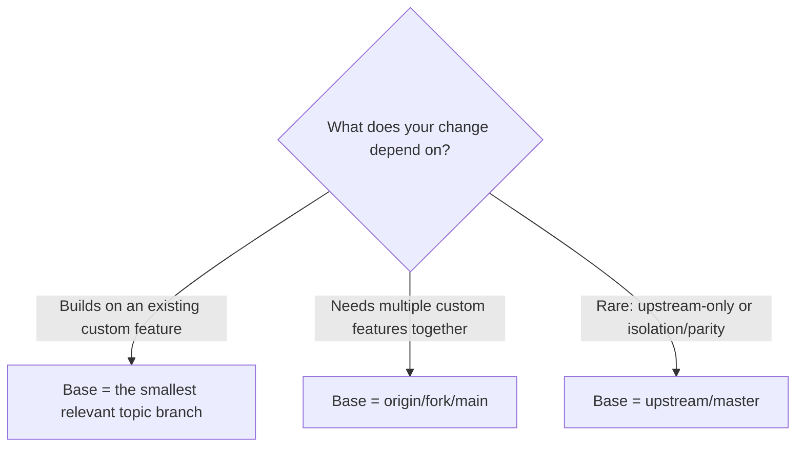

# GDevelop Fork Branching Strategy

This document explains the Git branching model used for this fork so you can develop features safely while staying in sync with upstream (4ian/GDevelop).

## TL;DR
- `master` is a clean mirror of `upstream/master` (no custom commits).
- Your custom work lives in topic branches (one per feature/change).
- `fork/main` is the integration branch (default) rebuilt from upstream + topic branches. Do not commit to it directly.
- A scheduled GitHub Action updates `master` and rebuilds `fork/main` daily at 06:00 UTC (and on manual trigger).

> Strong default for this fork
> - Start new work from `origin/fork/main` or the smallest relevant topic branch.
> - Only branch from `upstream/master` in rare cases (upstream-only fixes or explicit isolation/parity work).


---

## 1) Branch Structure Overview

- `upstream/master` (remote on 4ian/GDevelop): the canonical upstream; contains no custom work from this fork.
- `master` (this fork): a pristine mirror of `upstream/master`. Used as a clean base for rebasing topic branches. No direct commits.
- Topic branches (this fork): individual, focused branches based on `upstream/master` (or `master`) that carry a specific customization.
  - Examples: `docs/custom-ai`, `feature/custom-ai-core`, `feature/custom-ai-electron`, `chore/env-samples`, `build/deps`.
- `fork/main` (this fork, default branch): integration branch created by merging all topic branches on top of `upstream/master`. Do not commit to it directly.

Mermaid overview of relationships:

```mermaid
graph TD
  U[upstream/master (4ian)] --> M[master (mirror)]
  U --> T1[docs/custom-ai]
  U --> T2[feature/custom-ai-core]
  U --> T3[feature/custom-ai-electron]
  U --> T4[chore/env-samples]
  U --> T5[build/deps]
  T1 --> F[fork/main (integration)]
  T2 --> F
  T3 --> F
  T4 --> F
  T5 --> F
```

Important: `upstream/master` contains no custom work from this fork by design.

---

## 2) Workflow Guide for New Feature Development

Choose your base branch using this decision flow (optimized for this downstream fork):



- Branch from a specific topic branch when:
  - Default for extending/modifying that exact custom feature area.
  - Examples:
    ```bash
    # Build on Custom AI core
    git fetch origin
    git checkout -b feature/my-ai-tweak origin/feature/custom-ai-core

    # Build on Electron AI integration
    git checkout -b feature/my-electron-tweak origin/feature/custom-ai-electron
    ```

- Branch from `fork/main` when:
  - You need multiple custom features together to develop effectively.
  - Command:
    ```bash
    git fetch origin upstream
    git checkout -b feature/my-cross-cutting origin/fork/main
    ```

- Rare: Branch from `upstream/master` (or `master`) when:
  - Upstream-only fixes or intentionally isolated parity experiments.
  - Commands:
    ```bash
    git fetch upstream
    git checkout -b fix/upstream-only upstream/master
    # ... develop, commit ...
    git push -u origin fix/upstream-only
    ```

Tip: Prefer the smallest base that contains what you need. Avoid committing directly to `fork/main`.

---

## 3) Daily Development Commands

Create a new topic branch from the appropriate base (preferred order):
```bash
# 1) From a topic branch (default when extending a specific custom area)
git fetch origin
git checkout -b feature/my-followup origin/feature/custom-ai-core

# 2) From fork/main (when you need multiple custom areas together)
git fetch origin
git checkout -b feature/my-cross-cutting origin/fork/main

# 3) Rare: From upstream/master (upstream-only or isolation/parity)
git fetch upstream
git checkout -b fix/upstream-only upstream/master
```

Keep your topic branch current with upstream (rebase workflow):
```bash
git fetch upstream
# While on your topic branch
git rebase upstream/master
# If conflicts: resolve files, then
#   git add <files>
#   git rebase --continue
# Repeat until rebase completes.
# Push safely after rebasing:
git push --force-with-lease
```

Manually rebuild `fork/main` locally (if you need it before the scheduled job):
```bash
git fetch origin upstream
# Start from upstream/master
git checkout -B fork/main upstream/master
# Merge topic branches in order (remote tracking to ensure freshness)
git merge --no-ff origin/docs/custom-ai -m "merge: docs/custom-ai"
git merge --no-ff origin/feature/custom-ai-core -m "merge: feature/custom-ai-core"
git merge --no-ff origin/feature/custom-ai-electron -m "merge: feature/custom-ai-electron"
git merge --no-ff origin/chore/env-samples -m "merge: chore/env-samples"
git merge --no-ff origin/build/deps -m "merge: build/deps"
# Push integration branch
git push --force-with-lease origin fork/main
```

Pushing changes safely:
```bash
# First push (create upstream tracking)
git push -u origin feature/my-change

# After rebase (history rewrite), always use --force-with-lease
git push --force-with-lease
```

---

## 4) GitHub Action Automation

The scheduled workflow at `.github/workflows/sync-upstream.yml`:
- Runs daily at 06:00 UTC (and can be triggered manually in GitHub → Actions).
- Steps it performs:
  1) Update `master` to mirror `upstream/master` (hard reset + push with lease).
  2) Rebuild `fork/main` by checking out `upstream/master` and merging all topic branches in order.
  3) Push `fork/main` with `--force-with-lease`.

Notes:
- `fork/main` is an integration branch; do not commit to it directly.
- If you protect `master`/`fork/main` against force-push, the workflow will fail by design. We can switch to an “open PRs” model if desired.

---

## 5) Common Scenarios and Examples

- “I want to add a new AI provider”
  - Base: `origin/feature/custom-ai-core`
  - Example:
    ```bash
    git fetch origin
    git checkout -b feature/ai-provider-openrouter origin/feature/custom-ai-core
    ```

- “I want to modify Electron file storage”
  - Base: `origin/feature/custom-ai-electron`
  - Example:
    ```bash
    git fetch origin
    git checkout -b feature/ai-electron-storage-tweak origin/feature/custom-ai-electron
    ```

- “I want to fix an upstream bug unrelated to custom work”
  - Base: `upstream/master`
  - Example:
    ```bash
    git fetch upstream
    git checkout -b fix/upstream-something upstream/master
    ```

- “I want a feature that uses both AI core and Electron integration”
  - Base: `origin/fork/main`
  - Example:
    ```bash
    git fetch origin upstream
    git checkout -b feature/ai-cross-cutting origin/fork/main
    ```

---

## 6) Troubleshooting and Best Practices

Handling merge conflicts during rebase:
```bash
# On your topic branch after 'git rebase upstream/master'
# 1) Resolve conflicts in files
# 2) git add <resolved files>
# 3) git rebase --continue
# If you need to abort: git rebase --abort
```

Enable rerere to auto-apply repeated conflict resolutions:
```bash
git config --global rerere.enabled true
```

Safe force-push:
```bash
# Use this after any history rewrite (rebase, amend)
git push --force-with-lease
```

Verify which branch contains which custom work:
```bash
# Does upstream/master contain a file introduced by custom work?
# (Expect 0 for custom files)
git ls-tree -r --name-only upstream/master | grep -c '^newIDE/app/src/CustomAI/AIService.js$'

# Confirm presence in topic and integration branches
git ls-tree -r --name-only origin/feature/custom-ai-core | grep -c '^newIDE/app/src/CustomAI/AIService.js$'
git ls-tree -r --name-only origin/feature/custom-ai-electron | grep -c '^newIDE/electron-app/app/main/aiFileStorage.js$'

git diff --stat upstream/master..origin/fork/main -- newIDE/app/src/CustomAI

git log --oneline --merges origin/fork/main | head -n 10
```

Environment files and secrets:
- Keep `newIDE/electron-app/.env.local` untracked (do not commit secrets).
- Use `newIDE/app/.env.local.example` and `newIDE/electron-app/.env.local.example` as templates in the repo.
- If GitHub blocks a push due to detected secrets, remove the secret and amend the commit, then push again with `--force-with-lease`.

Branch protection:
- If you protect `master` or `fork/main` against force-push, the automation will fail.
- Alternative: switch to a workflow that opens PRs from topic branches into `fork/main` instead of force-pushing.

---

If you need this document updated as the set of topic branches changes, open a PR against `_docs/BRANCHING_STRATEGY.md` with your edits.

